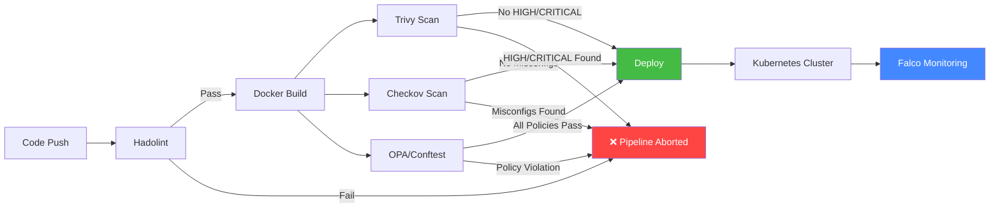

# 🛡️ Secure CI/CD Pipeline with Container Security Scanning

[](https://github.com/raghavendra2006/Secure-CI-CD-Pipeline-with-Container-Security-Scanning-using-Trivy-OPA-and-Falco/actions/workflows/devsecops-pipeline.yml)


A comprehensive **DevSecOps pipeline** that integrates security scanning and policy enforcement directly into a CI/CD workflow. This project demonstrates the "**Shift Left**" methodology by implementing automated security gates using industry-standard open-source tools: **Hadolint**, **Trivy**, **Checkov**, **Open Policy Agent (OPA)**, and **Falco**.

---

## 📑 Table of Contents

- [Architecture Overview](#-architecture-overview)
- [Security Gates](#-security-gates)
- [Tech Stack](#-tech-stack)
- [Project Structure](#-project-structure)
- [Prerequisites](#-prerequisites)
- [Quick Start](#-quick-start)
- [Pipeline Deep Dive](#-pipeline-deep-dive)
- [OPA Policies](#-opa-policies)
- [Falco Runtime Security](#-falco-runtime-security)
- [Interpreting Security Gates](#-interpreting-security-gates)
- [Local Development](#-local-development)
- [Screenshots & Evidence](#-screenshots--evidence)
- [Contributing](#-contributing)
- [License](#-license)

---

## 🏗️ Architecture Overview

```
┌──────────────────────────────────────────────────────────────────────────┐
│                        CODE PUSH (PR or Main)                            │
│                              │                                           │
│                              ▼                                           │
│  ┌─────────────────── CI/CD PIPELINE (GitHub Actions) ─────────────────┐ │
│  │                                                                     │ │
│  │  ┌──────────┐   ┌──────────┐   ┌──────────┐   ┌──────────────────┐ │ │
│  │  │ GATE 1   │   │ GATE 2   │   │ GATE 3   │   │ GATE 4          │ │ │
│  │  │ Hadolint │──▶│ Trivy    │──▶│ Checkov  │──▶│ OPA / Conftest  │ │ │
│  │  │ Dockerfile│  │ CVE Scan │   │ IaC Scan │   │ Policy Enforce  │ │ │
│  │  │ Linting  │   │          │   │          │   │                 │ │ │
│  │  └──────────┘   └──────────┘   └──────────┘   └────────┬────────┘ │ │
│  │       │              │              │                    │         │ │
│  │       │         ┌────┴────┐    ┌────┴────┐              │         │ │
│  │       │         │ JSON    │    │ JSON    │              │         │ │
│  │       │         │ Report  │    │ Report  │              │         │ │
│  │       │         │ Artifact│    │ Artifact│              │         │ │
│  │       │         └─────────┘    └─────────┘              │         │ │
│  │       │                                                  │         │ │
│  │       ▼ FAIL = ABORT                    ALL PASS ────────▼         │ │
│  │  ┌──────────────────────────────────────────────────────────────┐  │ │
│  │  │                    🚀 DEPLOY TO KUBERNETES                  │  │ │
│  │  └──────────────────────────────────────────────────────────────┘  │ │
│  └─────────────────────────────────────────────────────────────────────┘ │
│                              │                                           │
│                              ▼                                           │
│  ┌─────────────────── KUBERNETES CLUSTER ──────────────────────────────┐ │
│  │                                                                     │ │
│  │  ┌──────────────────┐          ┌───────────────────────────────┐   │ │
│  │  │  DevSecOps App   │◀─monitor─│  🔍 FALCO (Runtime Security) │   │ │
│  │  │  (devsecops ns)  │          │  • Shell detection            │   │ │
│  │  │                  │          │  • Sensitive file access       │   │ │
│  │  │  Pods (x2)       │          │  • Suspicious connections     │   │ │
│  │  └──────────────────┘          └────────────┬──────────────────┘   │ │
│  │                                              │                     │ │
│  │                                    ┌─────────▼─────────┐          │ │
│  │                                    │  Security Alerts  │          │ │
│  │                                    │  (SIEM / Slack)   │          │ │
│  │                                    └───────────────────┘          │ │
│  └─────────────────────────────────────────────────────────────────────┘ │
└──────────────────────────────────────────────────────────────────────────┘
```

### Pipeline Flow Diagram



---

## 🔒 Security Gates

| Gate | Tool | What It Checks | Fail Condition | Artifact |
|------|------|----------------|----------------|----------|
| **Gate 1** | 🔍 Hadolint | Dockerfile best practices | Any warning/error | `hadolint-report.json` |
| **Gate 2** | 🛡️ Trivy | Container image CVEs | HIGH or CRITICAL severity | `trivy-report.json` |
| **Gate 3** | 📋 Checkov | K8s manifest misconfigs | Severe security issues | `checkov-report.json` |
| **Gate 4** | ⚖️ OPA/Conftest | Custom organizational policies | Any policy denial | Console output |
| **Runtime** | 🔍 Falco | Live container behavior | Shell access, file reads | Security logs |

---

## 🛠️ Tech Stack

| Category | Tool | Purpose |
|----------|------|---------|
| **CI/CD** | GitHub Actions | Pipeline orchestration |
| **Container** | Docker | Application packaging |
| **Orchestration** | Kubernetes (k3d) | Container orchestration |
| **Dockerfile Lint** | Hadolint | Dockerfile best practices |
| **CVE Scanner** | Trivy | Vulnerability detection |
| **IaC Scanner** | Checkov | Infrastructure security |
| **Policy Engine** | OPA / Conftest | Custom policy enforcement |
| **Runtime Security** | Falco | Syscall monitoring |
| **Application** | Node.js / Express | Demo web application |

---

## 📁 Project Structure

```
.
├── .github/workflows/
│   └── devsecops-pipeline.yml    # GitHub Actions CI/CD pipeline
├── app/
│   ├── Dockerfile                # Hardened multi-stage Dockerfile
│   ├── package.json              # Node.js dependencies
│   └── server.js                 # Express.js application
├── k8s/
│   ├── namespace.yaml            # Dedicated namespace
│   ├── deployment.yaml           # Hardened deployment manifest
│   └── service.yaml              # ClusterIP service
├── policies/
│   ├── registry.rego             # Image registry restriction policy
│   ├── resources.rego            # Resource limits enforcement policy
│   └── labels.rego               # Mandatory labels policy
├── falco/
│   ├── custom-rules.yaml         # Custom Falco detection rules
│   └── falco-values.yaml         # Helm chart values for Falco
├── scripts/
│   ├── setup-cluster.sh          # Local k3d cluster bootstrap
│   └── demo-falco.sh             # Falco detection demonstration
├── docs/
│   └── SECURITY-GATES.md         # Detailed security gates reference
├── .gitignore
├── .hadolint.yaml                # Hadolint configuration
├── .trivyignore                  # CVE exception list
└── README.md                     # This file
```

---

## 📋 Prerequisites

Ensure the following tools are installed on your system:

| Tool | Version | Installation |
|------|---------|-------------|
| **Docker** | 24.0+ | [docs.docker.com](https://docs.docker.com/get-docker/) |
| **kubectl** | 1.28+ | [kubernetes.io](https://kubernetes.io/docs/tasks/tools/) |
| **k3d** | 5.6+ | `curl -s https://raw.githubusercontent.com/k3d-io/k3d/main/install.sh \| bash` |
| **Helm** | 3.12+ | [helm.sh](https://helm.sh/docs/intro/install/) |
| **Conftest** | 0.46+ | [conftest.dev](https://www.conftest.dev/install/) |
| **Trivy** | 0.50+ | [aquasecurity.github.io](https://aquasecurity.github.io/trivy/) |
| **Hadolint** | 2.12+ | [github.com/hadolint](https://github.com/hadolint/hadolint) |
| **Checkov** | 3.0+ | `pip install checkov` |

---

## 🚀 Quick Start

### 1. Clone the Repository

```bash
git clone https://github.com/raghavendra2006/Secure-CI-CD-Pipeline-with-Container-Security-Scanning-using-Trivy-OPA-and-Falco.git
cd Secure-CI-CD-Pipeline-with-Container-Security-Scanning-using-Trivy-OPA-and-Falco
```

### 2. Run Security Tools Locally

You can run the security audits locally using either native binaries or portable Docker containers (ideal for quick verification without local installations).

#### Option A: Running with Docker (Recommended, No Local Installation Required)

*   **Dockerfile Linting (Hadolint)**:
    *   *Linux/macOS (Bash)*:
        ```bash
        docker run --rm -i hadolint/hadolint < app/Dockerfile
        ```
    *   *Windows (PowerShell)*:
        ```powershell
        Get-Content app/Dockerfile | docker run --rm -i hadolint/hadolint
        ```
*   **Vulnerability Scanning (Trivy)**:
    ```bash
    docker run --rm -v ${pwd}:/root/.cache/ aquasec/trivy image --severity HIGH,CRITICAL devsecops-app:test
    ```
*   **Infrastructure as Code Scanning (Checkov)**:
    ```bash
    docker run --rm -v ${pwd}:/tf bridgecrew/checkov -d /tf/k8s
    ```
*   **OPA Policy Enforcement (Conftest)**:
    ```bash
    docker run --rm -v ${pwd}:/project -w /project openpolicyagent/conftest test k8s/ -p policies/
    ```

#### Option B: Running with Native Installed Binaries

```bash
# Gate 1: Lint the Dockerfile
hadolint app/Dockerfile

# Build the Docker image
docker build -t devsecops-app:test ./app/

# Gate 2: Scan for vulnerabilities
trivy image --severity HIGH,CRITICAL --exit-code 1 devsecops-app:test

# Gate 3: Scan Kubernetes manifests
checkov -d k8s/ --framework kubernetes

# Gate 4: Enforce OPA policies
conftest test k8s/*.yaml -p policies/
```

### 3. Bootstrap Local Kubernetes Cluster with Falco

```bash
# Make scripts executable
chmod +x scripts/*.sh

# Create cluster, deploy app, install Falco
./scripts/setup-cluster.sh
```

### 4. Demonstrate Falco Runtime Detection

```bash
# Run the Falco demo (simulates attack + captures alert)
./scripts/demo-falco.sh
```

### 5. Trigger the CI/CD Pipeline

```bash
# Push to GitHub to trigger the pipeline
git add .
git commit -m "feat: initial DevSecOps pipeline"
git push origin main
```

---

## 🔬 Pipeline Deep Dive

### Stage 1: Dockerfile Linting (Hadolint)

Hadolint parses the Dockerfile against Docker best practices:
- ✅ Uses pinned base image (`node:22-alpine`, not `latest`)
- ✅ Runs as non-root user (`USER appuser`)
- ✅ Includes `HEALTHCHECK` instruction
- ✅ Uses multi-stage build for smaller image
- ✅ Copies only necessary files

### Stage 2: Build Docker Image

Uses Docker Buildx to build the image, saves it as a pipeline artifact for subsequent scanning stages.

### Stage 3: Vulnerability Scanning (Trivy)

Trivy scans the built image before it leaves the pipeline:
- Scans OS packages and application dependencies
- Fails on **HIGH** or **CRITICAL** severity (`--exit-code 1`)
- Generates a JSON report uploaded as a pipeline artifact
- Trivy database is cached between runs for performance

### Stage 4: IaC Scanning (Checkov)

Checkov analyzes Kubernetes manifests for security misconfigurations:
- Verifies security contexts are properly set
- Checks for resource limits and requests
- Validates probe configurations
- Ensures containers don't run as root

### Stage 5: Policy Enforcement (OPA/Conftest)

Custom Rego policies enforce organizational standards not covered by generic scanners.

### Stage 6: Deploy

Only executes if **all four gates pass** AND the push is to the `main` branch.

---

## ⚖️ OPA Policies

### Policy 1: Registry Restriction (`policies/registry.rego`)

Prevents supply-chain attacks by requiring all container images to originate from the trusted corporate registry.

```rego
# Denies any image not from trusted-registry.company.com/
deny[msg] {
    input.kind == "Deployment"
    container := input.spec.template.spec.containers[_]
    not startswith(container.image, "trusted-registry.company.com/")
    msg := sprintf("Container '%s' uses untrusted image '%s'", [container.name, container.image])
}
```

### Policy 2: Resource Limits (`policies/resources.rego`)

Prevents resource exhaustion attacks and noisy-neighbor problems by requiring CPU and Memory constraints.

```rego
# Denies containers without resources.requests or resources.limits
deny[msg] {
    input.kind == "Deployment"
    container := input.spec.template.spec.containers[_]
    not container.resources.requests
    msg := sprintf("Container '%s' missing resources.requests", [container.name])
}
```

### Policy 3: Mandatory Labels (`policies/labels.rego`)

Enforces organizational governance by requiring a `cost-center` label for billing and tracking.

```rego
# Denies any resource without a cost-center label
deny[msg] {
    input.kind == "Deployment"
    not input.metadata.labels["cost-center"]
    msg := "Deployment must have a 'cost-center' label"
}
```

### Testing Policies

```bash
# Test all policies
conftest test k8s/*.yaml -p policies/ --all-namespaces

# Expected output (passing):
# PASS - k8s/deployment.yaml - main - no test failures
# PASS - k8s/service.yaml - main - no test failures
# PASS - k8s/namespace.yaml - main - no test failures
```

---

## 🔍 Falco Runtime Security

While the CI/CD pipeline catches issues **before** deployment, Falco monitors containers **after** they're running in Kubernetes.

### Custom Rules

| Rule | Trigger | Priority |
|------|---------|----------|
| Terminal Shell in Container | `/bin/bash` or `/bin/sh` spawned in a pod | WARNING |
| Sensitive File Access | Reading `/etc/shadow`, SSH keys | WARNING |
| Unexpected Outbound Connection | Connections to non-standard ports | NOTICE |

### Demonstrating Falco Detection

```bash
# Terminal 1: Watch Falco logs
kubectl logs -n falco -l app.kubernetes.io/name=falco -f

# Terminal 2: Simulate an attack (exec into pod)
kubectl exec -it $(kubectl get pods -n devsecops -o jsonpath='{.items[0].metadata.name}') \
  -n devsecops -- /bin/sh

# Terminal 1 will show:
# SECURITY ALERT: Shell spawned in container
# (user=appuser command=sh pid=123 container_name=devsecops-app
#  namespace=devsecops pod=devsecops-app-xxxxx)
```

### Sample Falco Alert Output

```json
{
  "output": "SECURITY ALERT: Shell spawned in container (user=appuser command=sh pid=42 container_id=abc123 container_name=devsecops-app namespace=devsecops pod=devsecops-app-7d8f9b6c4-x2k9p)",
  "priority": "Warning",
  "rule": "Terminal Shell in DevSecOps Container",
  "time": "2026-07-06T09:30:00.000000000Z",
  "output_fields": {
    "container.id": "abc123",
    "container.name": "devsecops-app",
    "k8s.ns.name": "devsecops",
    "k8s.pod.name": "devsecops-app-7d8f9b6c4-x2k9p",
    "proc.cmdline": "sh",
    "proc.name": "sh",
    "user.name": "appuser"
  }
}
```

---

## 📊 Interpreting Security Gates

### When a Gate Fails

| Scenario | Gate | What You'll See | How to Fix |
|----------|------|----------------|------------|
| Using `FROM node:latest` | Hadolint | `DL3007 - Using latest tag` | Pin version: `FROM node:18-alpine` |
| Outdated `express@4.17.1` | Trivy | `CVE-2024-XXXXX - HIGH` | Update: `npm install express@latest` |
| Missing `securityContext` | Checkov | `CKV_K8S_20 FAILED` | Add `allowPrivilegeEscalation: false` |
| Image from Docker Hub | OPA | `REGISTRY VIOLATION` | Use `trusted-registry.company.com/` prefix |
| No resource limits | OPA | `RESOURCE VIOLATION` | Add `resources.requests` and `resources.limits` |
| Missing `cost-center` label | OPA | `LABEL VIOLATION` | Add `cost-center` to `metadata.labels` |
| Shell access in prod | Falco | `SECURITY ALERT: Shell spawned` | Investigate with incident response team |

### Pipeline Status Indicators

```
✅ All Green  → Safe to deploy, all security gates passed
❌ Any Red    → Pipeline blocked, must fix before merge
⚠️ Warning   → Non-blocking issues found, review recommended
```

### 🛡️ Pipeline Security Remediation & Hardening History

During the pipeline stabilization and hardening phases, several security vulnerability and compliance issues were identified across the gates and remediated:

*   **Base Image Upgrade**: Migrated the application base image from `node:18-alpine` to `node:22-alpine` to utilize a modern, highly patched runtime environment.
*   **System Package Upgrades**: Added system-wide package updates (`apk update && apk upgrade --no-cache`) in both builder and runner stages to automatically patch any baseline container OS vulnerabilities.
*   **Attack Surface Minimization & Package Manager Deletion**: Removed `npm`, `yarn`, `corepack`, and `npx` from the final production stage of the `Dockerfile`. Furthermore, recursively deleted the Alpine package manager (`/sbin/apk`, `/lib/apk`, `/etc/apk`) to lock down the production runtime filesystem against any utility installation or package injection.
*   **Dependency Upgrades**: Upgraded `express` from `4.17.1` to `4.21.2` in `package.json` to resolve several HIGH and CRITICAL vulnerabilities.
*   **Dependency Overrides**: Added an npm `overrides` configuration in `package.json` to pin `path-to-regexp` to `0.1.13`, successfully remediating `CVE-2026-4867` (Denial of Service via catastrophic backtracking).
*   **Express Response & Signature Hardening**: Custom response security headers (such as `X-Frame-Options`, `X-Content-Type-Options`, and `Content-Security-Policy`) were added, and Express runtime signature disclosure (`X-Powered-By`) was disabled to prevent framework profiling.
*   **Node.js Memory Rate Limiting**: Built and integrated a lightweight, zero-dependency, in-memory rate-limiter middleware with active garbage collection to mitigate Denial of Service (DoS) attacks.
*   **Node.js Graceful Shutdown**: Configured process-level signal listeners (`SIGTERM`, `SIGINT`) to ensure all connections are gracefully terminated upon pod termination.
*   **Checkov Compliance (CKV_K8S_40 & CKV2_K8S_6)**: 
    *   Increased user and group IDs to `10001` (setting `runAsUser: 10001` and `runAsGroup: 10001` in `k8s/deployment.yaml`) to satisfy Checkov's security rules requiring user IDs above `10000`.
    *   Created and applied a Kubernetes `NetworkPolicy` to restrict pod ingress/egress to trusted routes, which allowed us to remove the Checkov bypass for `CKV2_K8S_6`.
*   **Trivy Configuration**: Configured `ignore-unfixed: true` in the GitHub Actions workflow to filter out OS-level packages lacking official upstream security patches, preventing build failures due to unpatchable dependencies.
*   **CI/CD Supply Chain Hardening**:
    *   Pinned all third-party GitHub Actions to immutable, audited commit SHAs (rather than mutable tags like `@v4` or `@master`).
    *   Hardened Conftest binary installation by verifying the downloaded archive's SHA256 checksum against OPA's official `checksums.txt` before execution.
    *   Stabilized Trivy database caching by using a date-based cache key instead of unique run IDs.

---

## 💻 Local Development

### Running the Application Locally

```bash
cd app/
npm install
npm start
# Server runs on http://localhost:3000
```

### Endpoints

| Endpoint | Description |
|----------|-------------|
| `GET /` | Application metadata and welcome message |
| `GET /healthz` | Liveness probe (Kubernetes) |
| `GET /readyz` | Readiness probe (Kubernetes) |
| `GET /info` | System and runtime information |
| `GET /security` | Security posture summary |

### Running Security Tools Individually

```bash
# Hadolint (Dockerfile lint)
hadolint app/Dockerfile

# Trivy (vulnerability scan)
trivy image devsecops-app:latest --severity HIGH,CRITICAL

# Trivy (JSON report)
trivy image devsecops-app:latest --format json -o trivy-report.json

# Checkov (IaC scan)
checkov -d k8s/ --framework kubernetes

# Checkov (JSON report)
checkov -d k8s/ --framework kubernetes -o json > checkov-report.json

# OPA/Conftest (policy check)
conftest test k8s/*.yaml -p policies/ --all-namespaces
```

---

## 📸 Screenshots & Evidence

### CI/CD Pipeline (GitHub Actions)

> After pushing to `main`, the pipeline runs all 6 stages sequentially.
> Screenshots of the pipeline execution will be available in the Actions tab
> of the GitHub repository after the first push.

### Security Gate Results

> **Trivy Report**: Available as a downloadable artifact (`trivy-vulnerability-report`)
> from the GitHub Actions run. Contains a full JSON breakdown of all detected CVEs.

> **Checkov Report**: Available as a downloadable artifact (`checkov-iac-report`)
> from the GitHub Actions run. Contains pass/fail results for all Kubernetes security checks.

### Falco Runtime Alert

> Run `./scripts/demo-falco.sh` to generate a Falco alert demonstration.
> The alert log is saved to `security-logs/falco-alert-*.log`.

---

## 🤝 Contributing

1. Fork the repository
2. Create a feature branch (`git checkout -b feature/amazing-feature`)
3. Ensure all security gates pass locally:
   ```bash
   hadolint app/Dockerfile
   conftest test k8s/*.yaml -p policies/
   ```
4. Commit your changes (`git commit -m 'feat: add amazing feature'`)
5. Push to the branch (`git push origin feature/amazing-feature`)
6. Open a Pull Request

---

## 📄 License

This project is licensed under the MIT License. See the [LICENSE](LICENSE) file for details.

---

## 🔗 References

| Resource | Link |
|----------|------|
| Hadolint | [github.com/hadolint/hadolint](https://github.com/hadolint/hadolint) |
| Trivy | [aquasecurity.github.io/trivy](https://aquasecurity.github.io/trivy) |
| Checkov | [checkov.io](https://www.checkov.io/) |
| OPA / Rego | [openpolicyagent.org](https://www.openpolicyagent.org/) |
| Conftest | [conftest.dev](https://www.conftest.dev/) |
| Falco | [falco.org](https://falco.org/) |
| Rego Playground | [play.openpolicyagent.org](https://play.openpolicyagent.org/) |
| k3d | [k3d.io](https://k3d.io/) |

---

<p align="center">
  <b>Built with 🔒 Security-First Mindset</b><br>
  <sub>DevSecOps Pipeline — Shifting Security Left</sub>
</p>